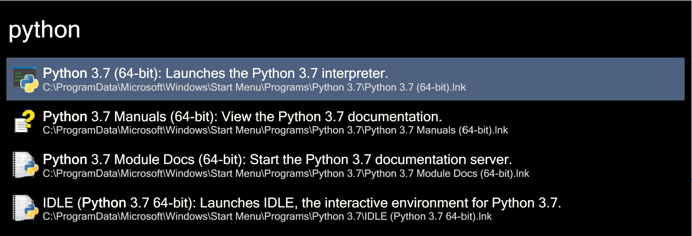
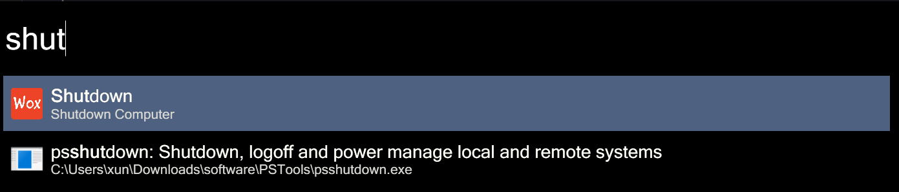
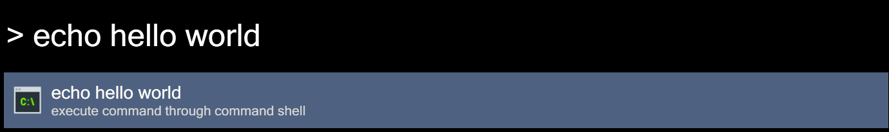
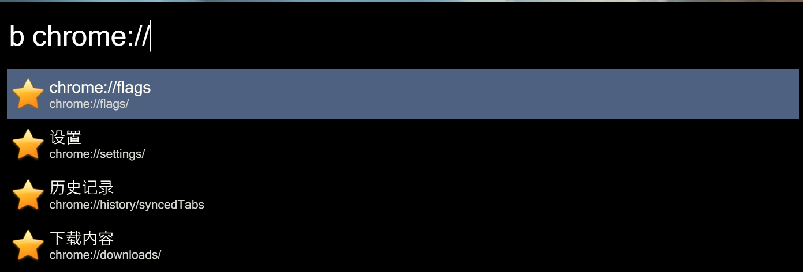

# Wox Documentation

**This doc** contains all intructions of Wox, including basic usage, settings and how to make a Wox plugin/theme.

!!! note "Quick Start"
    Jump to [Catalogue](#catalogue) to ignore unnecessary information. For **beginners**, read **Basic Usage** part carefully.

???+ example "Examples"
    ???+ example "Find Applications"
        
    ???+ example "Find Built-In usages"
        
    ???+ example "Terminal input"
        
    ???+ example "Bookmark"
        

## Introduction

Here we explain some intelligent ideas of `Wox`.

### What is Wox? 

Wox is a launcher in `Windows`. We are trying to make `Wox` work like `Alfred`.

You can use to search local programs, files. It can also search web content by using plugins, such as how is the weather today, what's the score of xxx movie and so on.

!!! note "Wox: A Plugin-based Launcher"
    Wox is based on **plugins**. We regard each plugin as an individual program, and use some keywords to triger it.

- Normally the input string should look like `A xxxxx`, where **A** is the Action keyword, and **xxxxx** is what you want to tell the plugin.

System plugin generally does not require keywords (except Web Search plugin) and user can't uninstall those system plugins now, they all built-in plugins. 
User plugin requires a action keyword. 
For example, I want to use the youdao translator plugin, then you need to use the yd + space + words. 
The action keyword can be configured, and I will introduce how to use shortcuts to simplify this process in the following sections.

Wox is `plugin-based`, see more about explaination at [intro of plugins](start.md#plugin-based-launcher).

### Why we develop Wox?

<place-holder>

### History

Before written Wox, I always wanted to write a launcher. I like to using hotkeys instead of keyboards, especially after using Vim. 
`Win + R` inside Windows cannot search programs, not good for me. I also used `Launchy`, but it seems stopped maintanence for a long time. 
Back to 2011, I tried to using C-lang to make some attempts, like [fstart](https://code.google.com/p/fstart/) and [smartrun](https://code.google.com/p/smartrun/). 
Maybe I'm a new guy to coding at that time, those attempts failed at the end. 
Probably in November 2013, I know `Alfred`, an awesome launcher in Mac. 
Unfortunately, there is no such thing under Windows :(

So, naturally, I came up an idea that making a launcher like Alfred, even the name initially was made as WinAlfred. I made a [post](http://v2ex.com/t/93922) on V2ex, which has some of the affirmative, later some people get involved in the project. In the middle of the developing Wox, I was warned by Alfred. Because the WinAlfred name contains Alfred, and cannot be used because that's their trademark. Finally, Wox come.

##### 
Author: [Bao Qian](#baoqian)

### Supplements

If you don't know what `Alfred` is, search it on google.

!!! info "Active Fork"
    The active fork is @jjw24/Wox, just push your new ideas or open issues if you want.

The original repo is not archived, but far behind this fork.

Thank [Bao Qian](#baoqian) for his generous work. You can find more in [History Section](#history)

## Catalogue

- [Install Wox](install.md)
- [**Getting Started**](start.md): contains all basic usage of `Wox`, **this is what you should read as a beginner**.
    - [Quick Start](start.md): a start guide
    - [Basic Plugins Usage](plugins.md): contains all built-in plugins usage and settings.
    - [Theme Usage](themes.md): contains all theme-related usage and settings.
    - [Settings](settings.md): contains all settings except `plugins` and `theme` of the main page.
- [Advanced Usage with plugins](plugins/popular.md): more about plugins, install, usage and develop.
<!-- contain install, builtin usage, other usage, develop, 4 parts. -->
- [Keep up to date](start.md#update): The update method
- [Developer](develop.md): redirect developers to what they want to modify.

<!-- Logic: Tutorial give all basic usage, and store at `basic` folder. Details (plugin, theme, refer) can be found in different folder. -->

### Projects

This is the expansion of [Source](README.md#sources)

- **Wox.Wiki** (this doc)
  - This doc is open sourced at: ==@hsungong/Wox.Wiki==
  - If you want to help improve this doc or translate it to your native language, open issues at @hsungong/Wox.Wiki/issues or email to me with [email](mailto:gongxuncd@gmail.com)

- **Wox** (or Wox-Launcher) 
    - It is now open sourced at @jjw24/Wox, any pull requests and issues are appreciate.
    - The original location can be found at 

#### Other projects

<place-holder>

## References
<!-- 锚点：
必须全小写
空格用’-'代替
‘_’ '()'需要去掉
-->

If the doc is not written by the maintainer [Xun Gong](#xungong), the author will be pointed out.

- <a id="xungong">Xun Gong</a>: As the `maintainer` 
    - Visit my [Github Page](https://github.com/hsungong), or [Email to me](mailto:gongxuncd@gmail.com).

- <a id="baoqian">Bao Qian</a>: The creator. [Github](https://github.com/bao-qian), and [Email](mailto:qianlf2008@163.com)