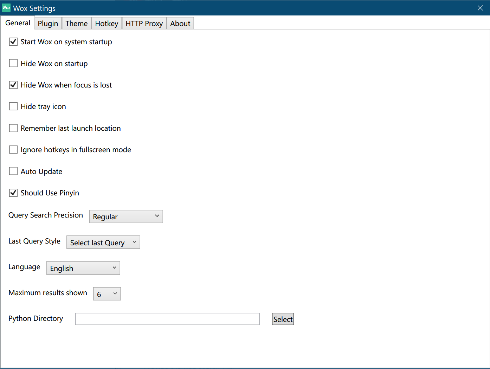

## Wox Settings

### General

- `Start Wox on system startup`: Tick it if you want.
- `Hide Wox on startup`: If tick, after start Wox program, the query box will hide at first. If you want to open `query box`, press `Alt+Space`
- `Hide Wox when focus is lost`: This means if you don't use Wox, the query box will hide. `Default: Tick`
- `Hide tray icon`: This will change `Windows Settings -> Taskbar -> Select which icons appear on the taskbar`. If tick, Wox icon will disappear in taskbar(you can not found). (Which means the only way to open settings is (1))
- `Remeber last launch location`: *BUG: Not clear yet*
- `Iqnore hotkey in fullscreen mode`: This will ignore hotkey if you enter the fullscreen mode. *BUG: This doesn't seem to work*
- `Auto Update`: *BUG: This doesn't seem to work.*
- `Should Use Pinyin`: This is special for `Chinese Query`. For example, `yd` will respond to `有道` or `youdao`.
- `Query Search Precision`: *BUG: Not clear yet*
- `Last Query Style`: *BUG: Not clear yet*
<!-- - This means the next time you open `query box`, your last input will remain in query box. -->
- `Language`: Language support has : English, 中文, 中文（繁体）, Українська, Русский, Français, 日本語, Dutch, Polski, Dansk, Deutsch, 한국어, Srpski, Português (Brasil), Italiano, Norsk Bokmål, Slovenský.
- `Maximum results shown`: The max number of results(each result occupy one line) shows each time. If you want to see more, `scroll it`. 
- `Python Directory`: The path to `python.exe`. If you have already set the environment variable `PATH`, there is no need to set it. Else, set path here.

### Theme

Wox supports themes. You can choose your favorite theme or design your own theme.

#### Browse themes

> Default: Dark, Recommend: `BlackAndWhite` or `BlurBlack`

Browse on web:

In addition, we also offer an online theme maker ThemeBuilder. Once theme is configured on the Web site, click on download, and rename it as following format: <your theme name>.xaml. You can then put this theme file in Theme directory in the root of Wox directory and restart the Wox. After restart Wox, user can see new theme in the theme list.

#### Fonts

### Hotkey

### HTTP Proxy

### About